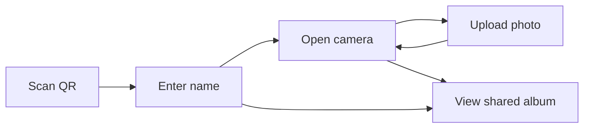

# Wedding Shared Album

Mobile-first wedding photo sharing app inspired by satualbum.id. Guests scan a QR code, enter their name once, capture a limited number of photos, and all moments appear in one shared gallery.

## Features

- QR landing page for guests at the venue
- Name gate with per-device photo limit (default 10)
- Live camera capture with flip camera and file upload fallback
- Shared gallery with lightbox, per-photo likes, and download
- Printable QR page for the host

## Tech Stack

- Next.js (App Router, TypeScript)
- Tailwind CSS
- Supabase (Postgres + Storage)

## Setup

### 1. Create Supabase project

1. Go to [supabase.com](https://supabase.com) and create a project.
2. Open the SQL Editor and run the contents of [`supabase/schema.sql`](supabase/schema.sql).
3. In Project Settings → API, copy:
   - Project URL
   - anon public key
   - service_role key

### 2. Configure environment variables

```bash
cp .env.local.example .env.local
```

Fill in your Supabase keys and customize wedding text:

```env
NEXT_PUBLIC_SUPABASE_URL=...
NEXT_PUBLIC_SUPABASE_ANON_KEY=...
SUPABASE_SERVICE_ROLE_KEY=...
NEXT_PUBLIC_PHOTO_LIMIT=10
NEXT_PUBLIC_WEDDING_TITLE=Our Wedding Day
NEXT_PUBLIC_WEDDING_SUBTITLE=Abadikan momen indah hari spesial kami
NEXT_PUBLIC_SITE_URL=http://localhost:3000
```

### 3. Run locally

```bash
npm install
npm run dev
```

Open:

- `/` guest landing + name gate
- `/capture` camera page
- `/gallery` shared album
- `/qr` printable QR code

## Deploy to Vercel

1. Push this repo to GitHub.
2. Import the project in Vercel.
3. Add the same environment variables from `.env.local`.
4. Set `NEXT_PUBLIC_SITE_URL` to your production URL.
5. Deploy, then open `/qr` and print the QR for your venue.

## Guest Flow



## Notes

- Photo limits are enforced server-side using the `register_photo_upload` Postgres function.
- Guest identity is tracked by a device ID stored in `localStorage`.
- All writes go through Next.js API routes using the Supabase service role key.
- Gallery reads are public via Supabase RLS and the public storage bucket.

## Project Structure

```text
src/
  app/
    page.tsx              # Landing / name gate
    capture/page.tsx      # Camera capture
    gallery/page.tsx      # Shared album
    qr/page.tsx           # Printable QR
    api/guest/route.ts    # Register guest + status
    api/upload/route.ts   # Upload photo
    api/like/route.ts     # Toggle photo like
  components/             # UI components
  lib/                    # Supabase, device, constants
supabase/schema.sql       # Database + storage setup
```
